# [📈 Live Status](https://uptime.webworldview.com): <!--live status--> **🟧 Partial outage**

This repository contains the open-source uptime monitor and status page for [webworldview](https://uptime.webworldview.com), powered by [Upptime](https://github.com/upptime/upptime).

With [Upptime](https://upptime.js.org), you can get your own unlimited and free uptime monitor and status page, powered entirely by a GitHub repository. We use [Issues](https://github.com/webworldview/uptime/issues) as incident reports, [Actions](https://github.com/webworldview/uptime/actions) as uptime monitors, and [Pages](https://uptime.webworldview.com) for the status page.

<!--start: status pages-->
<!-- This summary is generated by Upptime (https://github.com/upptime/upptime) -->
<!-- Do not edit this manually, your changes will be overwritten -->
<!-- prettier-ignore -->
| URL | Status | History | Response Time | Uptime |
| --- | ------ | ------- | ------------- | ------ |
|  [Johnsondata](https://www.johnsondata.com.au) | 🟩 Up | [johnsondata.yml](https://github.com/webworldview/uptime/commits/HEAD/history/johnsondata.yml) | 

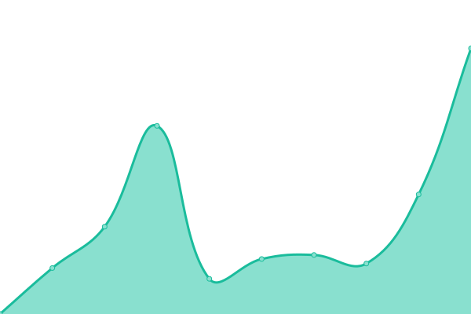 1417ms
     
 | 

<a href="https://uptime.webworldview.com/history/johnsondata">100.00%</a>
    

|  [Chill](https://www.chillrefrigerated.com.au) | 🟩 Up | [chill.yml](https://github.com/webworldview/uptime/commits/HEAD/history/chill.yml) | 

 1281ms
     
 | 

<a href="https://uptime.webworldview.com/history/chill">100.00%</a>
    

|  [CityChapel](https://www.citychapel.com.au) | 🟩 Up | [city-chapel.yml](https://github.com/webworldview/uptime/commits/HEAD/history/city-chapel.yml) | 

 292ms
     
 | 

<a href="https://uptime.webworldview.com/history/city-chapel">100.00%</a>
    

|  [Soek Aus](https://www.soek.com.au) | 🟩 Up | [soek-aus.yml](https://github.com/webworldview/uptime/commits/HEAD/history/soek-aus.yml) | 

 382ms
     
 | 

<a href="https://uptime.webworldview.com/history/soek-aus">100.00%</a>
    

|  [Soek NZ](https://www.soek.co.nz) | 🟩 Up | [soek-nz.yml](https://github.com/webworldview/uptime/commits/HEAD/history/soek-nz.yml) | 

 282ms
     
 | 

<a href="https://uptime.webworldview.com/history/soek-nz">100.00%</a>
    

|  [Soek SA](https://www.soeksunglasses.co.za) | 🟩 Up | [soek-sa.yml](https://github.com/webworldview/uptime/commits/HEAD/history/soek-sa.yml) | 

 390ms
     
 | 

<a href="https://uptime.webworldview.com/history/soek-sa">100.00%</a>
    

|  [Soek UK](https://soek.co.uk) | 🟩 Up | [soek-uk.yml](https://github.com/webworldview/uptime/commits/HEAD/history/soek-uk.yml) | 

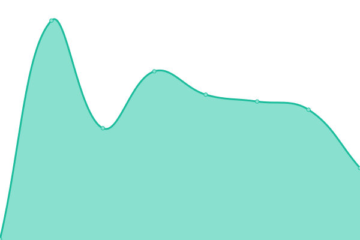 211ms
     
 | 

<a href="https://uptime.webworldview.com/history/soek-uk">100.00%</a>
    

|  [Soek CA/US](https://www.soeksunglasses.com/) | 🟩 Up | [soek-ca-us.yml](https://github.com/webworldview/uptime/commits/HEAD/history/soek-ca-us.yml) | 

 303ms
     
 | 

<a href="https://uptime.webworldview.com/history/soek-ca-us">45.98%</a>
    

|  [Checking For You](https://www.checkingforyou.com) | 🟩 Up | [checking-for-you.yml](https://github.com/webworldview/uptime/commits/HEAD/history/checking-for-you.yml) | 

 120ms
     
 | 

<a href="https://uptime.webworldview.com/history/checking-for-you">100.00%</a>
    

|  [EasyTastyKeto](https://www.easytastyketo.com) | 🟩 Up | [easy-tasty-keto.yml](https://github.com/webworldview/uptime/commits/HEAD/history/easy-tasty-keto.yml) | 

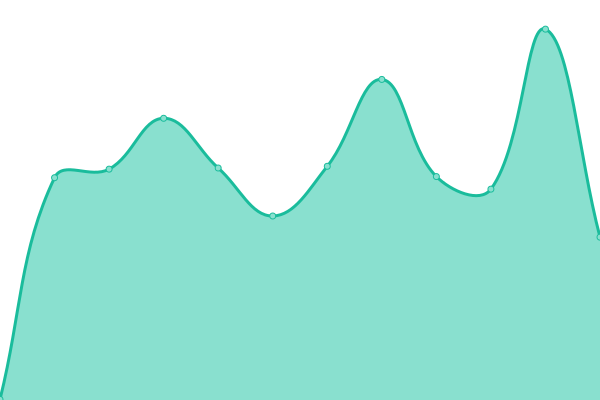 477ms
     
 | 

<a href="https://uptime.webworldview.com/history/easy-tasty-keto">100.00%</a>
    

|  [EasyTastyKeto Recipes](https://recipes.easytastyketo.com) | 🟥 Down | [easy-tasty-keto-recipes.yml](https://github.com/webworldview/uptime/commits/HEAD/history/easy-tasty-keto-recipes.yml) | 

 73ms
     
 | 

<a href="https://uptime.webworldview.com/history/easy-tasty-keto-recipes">100.00%</a>
    

|  [OGS](https://organicgardeningsecrets.net) | 🟩 Up | [ogs.yml](https://github.com/webworldview/uptime/commits/HEAD/history/ogs.yml) | 

 288ms
     
 | 

<a href="https://uptime.webworldview.com/history/ogs">100.00%</a>
    

|  [Sharda Bakers Dog World](https://www.shardabakersdogworld.com) | 🟩 Up | [sharda-bakers-dog-world.yml](https://github.com/webworldview/uptime/commits/HEAD/history/sharda-bakers-dog-world.yml) | 

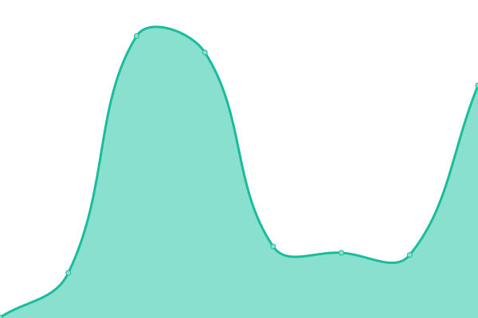 306ms
     
 | 

<a href="https://uptime.webworldview.com/history/sharda-bakers-dog-world">100.00%</a>
    

|  [Web World View](https://www.webworldview.com) | 🟩 Up | [web-world-view.yml](https://github.com/webworldview/uptime/commits/HEAD/history/web-world-view.yml) | 

 5733ms
     
 | 

<a href="https://uptime.webworldview.com/history/web-world-view">99.76%</a>
    

|  [Christian T Land](https://christiantland.com) | 🟩 Up | [christian-t-land.yml](https://github.com/webworldview/uptime/commits/HEAD/history/christian-t-land.yml) | 

 131ms
     
 | 

<a href="https://uptime.webworldview.com/history/christian-t-land">100.00%</a>
    

|  [Learning Goo](https://www.learninggoo.com) | 🟩 Up | [learning-goo.yml](https://github.com/webworldview/uptime/commits/HEAD/history/learning-goo.yml) | 

 131ms
     
 | 

<a href="https://uptime.webworldview.com/history/learning-goo">100.00%</a>
    

|  [Prime Life Women](https://primelifewomen.com) | 🟥 Down | [prime-life-women.yml](https://github.com/webworldview/uptime/commits/HEAD/history/prime-life-women.yml) | 

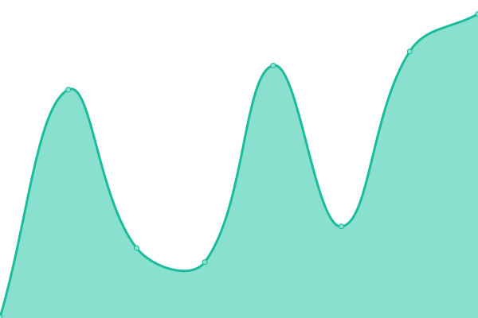 3236ms
     
 | 

<a href="https://uptime.webworldview.com/history/prime-life-women">70.48%</a>
    

|  [The Good Cyclist](https://thegoodcyclist.iwview.com) | 🟩 Up | [the-good-cyclist.yml](https://github.com/webworldview/uptime/commits/HEAD/history/the-good-cyclist.yml) | 

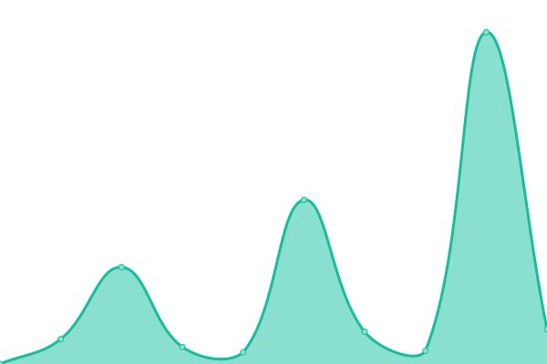 5709ms
     
 | 

<a href="https://uptime.webworldview.com/history/the-good-cyclist">100.00%</a>
    

|  [Bible Bunny](www.biblebunny.com) | 🟥 Down | [bible-bunny.yml](https://github.com/webworldview/uptime/commits/HEAD/history/bible-bunny.yml) | 

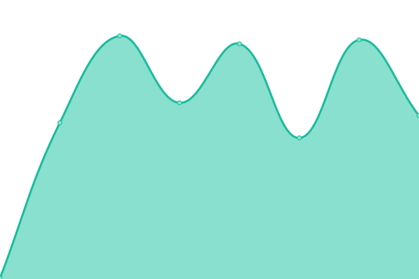 0ms
     
 | 

<a href="https://uptime.webworldview.com/history/bible-bunny">0.00%</a>
    

|  [Essori](https://www.essori.com) | 🟥 Down | [essori.yml](https://github.com/webworldview/uptime/commits/HEAD/history/essori.yml) | 

 0ms
     
 | 

<a href="https://uptime.webworldview.com/history/essori">0.00%</a>
    

|  [Jeffs Corner](https://jeffscorner.com) | 🟥 Down | [jeffs-corner.yml](https://github.com/webworldview/uptime/commits/HEAD/history/jeffs-corner.yml) | 

 22781ms
     
 | 

<a href="https://uptime.webworldview.com/history/jeffs-corner">0.00%</a>
    

|  [Jeff with Susan](https://www.jeffwithsusan.com) | 🟩 Up | [jeff-with-susan.yml](https://github.com/webworldview/uptime/commits/HEAD/history/jeff-with-susan.yml) | 

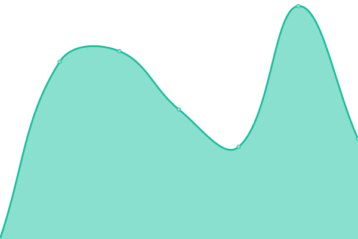 739ms
     
 | 

<a href="https://uptime.webworldview.com/history/jeff-with-susan">100.00%</a>
    

|  [MindyBodyHealth and Fitness](www.mindbodyhealthandfitness.com) | 🟩 Up | [mindy-body-health-and-fitness.yml](https://github.com/webworldview/uptime/commits/HEAD/history/mindy-body-health-and-fitness.yml) | 

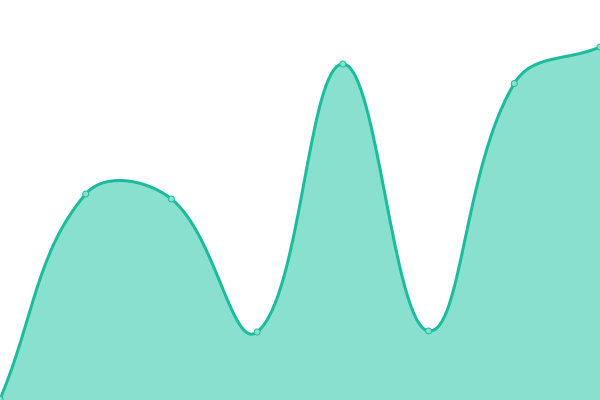 293ms
     
 | 

<a href="https://uptime.webworldview.com/history/mindy-body-health-and-fitness">100.00%</a>
    

|  [New CTLAND](https://new.christiantland.com) | 🟩 Up | [new-ctland.yml](https://github.com/webworldview/uptime/commits/HEAD/history/new-ctland.yml) | 

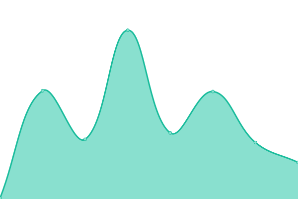 120ms
     
 | 

<a href="https://uptime.webworldview.com/history/new-ctland">100.00%</a>
    

|  [Test OGS](https://test.organicgardeningsecrets.net) | 🟩 Up | [test-ogs.yml](https://github.com/webworldview/uptime/commits/HEAD/history/test-ogs.yml) | 

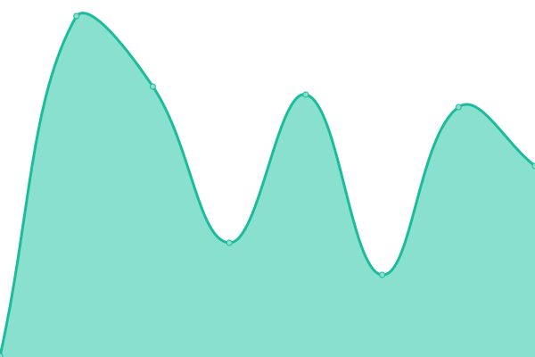 224ms
     
 | 

<a href="https://uptime.webworldview.com/history/test-ogs">100.00%</a>
    

|  [Google](https://www.google.com) | 🟩 Up | [google.yml](https://github.com/webworldview/uptime/commits/HEAD/history/google.yml) | 

 80ms
     
 | 

<a href="https://uptime.webworldview.com/history/google">100.00%</a>
    

|  [Member Genesis](https://www.membergenesis.com) | 🟩 Up | [member-genesis.yml](https://github.com/webworldview/uptime/commits/HEAD/history/member-genesis.yml) | 

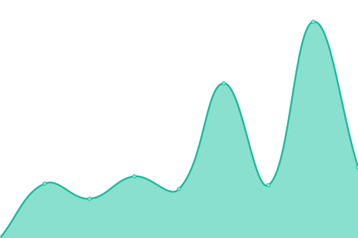 3677ms
     
 | 

<a href="https://uptime.webworldview.com/history/member-genesis">100.00%</a>
    

|  [DragonBoat Times](https://www.dragonboattimes.com) | 🟩 Up | [dragon-boat-times.yml](https://github.com/webworldview/uptime/commits/HEAD/history/dragon-boat-times.yml) | 

 326ms
     
 | 

<a href="https://uptime.webworldview.com/history/dragon-boat-times">99.84%</a>
    

|  [TestPlayDump](https://www.testplaydump.com) | 🟥 Down | [test-play-dump.yml](https://github.com/webworldview/uptime/commits/HEAD/history/test-play-dump.yml) | 

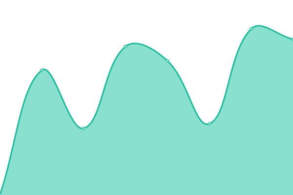 308ms
     
 | 

<a href="https://uptime.webworldview.com/history/test-play-dump">22.82%</a>
    

|  [MySnazzyGear Placeholder](https://www.mysnazzygear.com) | 🟩 Up | [my-snazzy-gear-placeholder.yml](https://github.com/webworldview/uptime/commits/HEAD/history/my-snazzy-gear-placeholder.yml) | 

 396ms
     
 | 

<a href="https://uptime.webworldview.com/history/my-snazzy-gear-placeholder">100.00%</a>
    

<!--end: status pages-->

[**Visit our status website →**](https://uptime.webworldview.com)

## 📄 License

- Powered by: [Upptime](https://github.com/upptime/upptime)
- Code: [MIT](./LICENSE) © [webworldview](https://uptime.webworldview.com)
- Data in the `./history` directory: [Open Database License](https://opendatacommons.org/licenses/odbl/1-0/)
